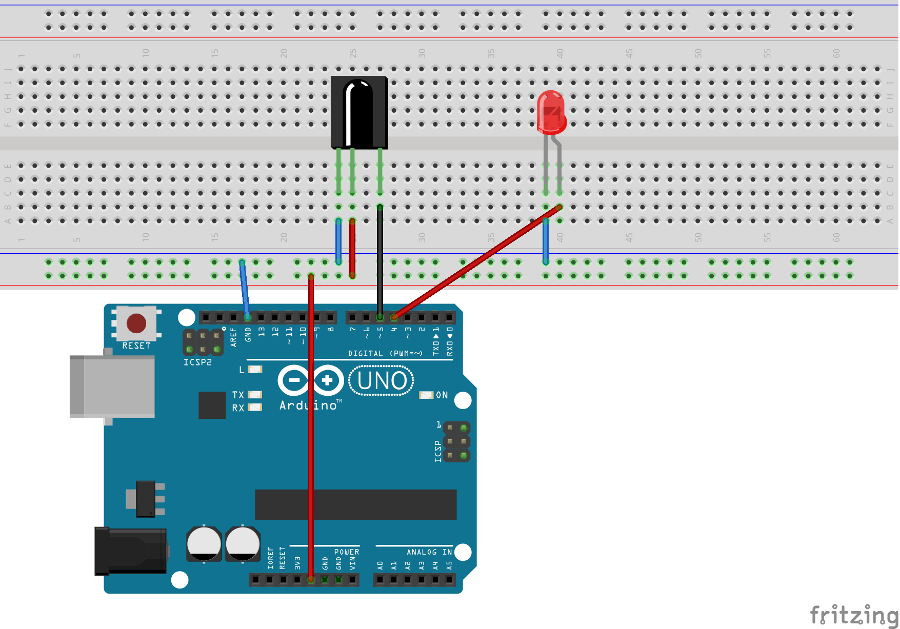
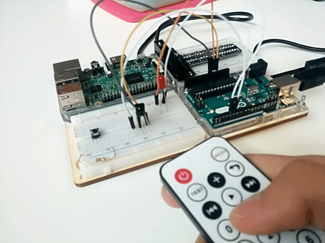
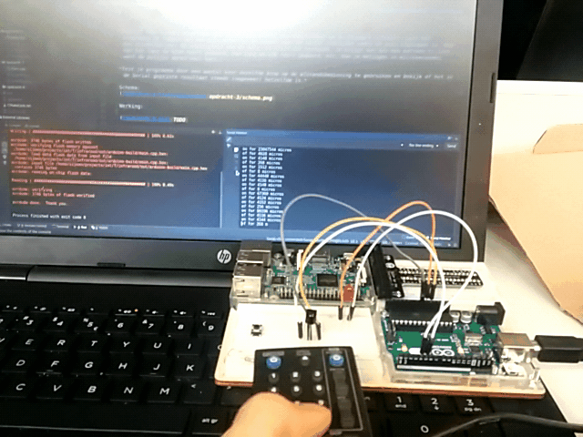
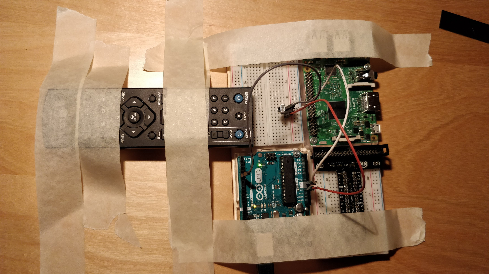
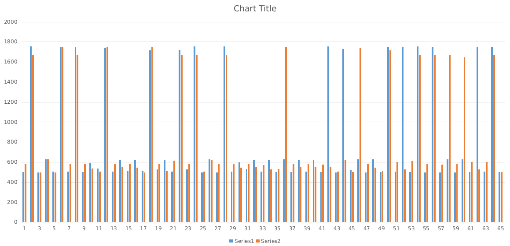
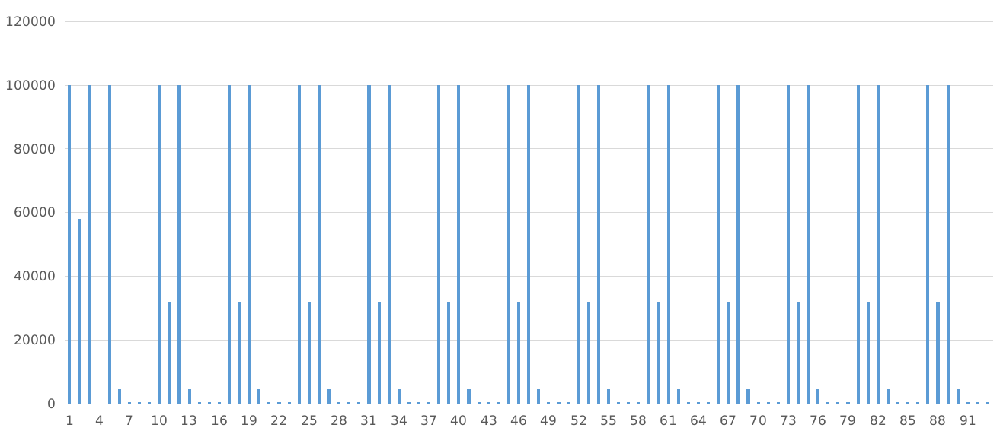
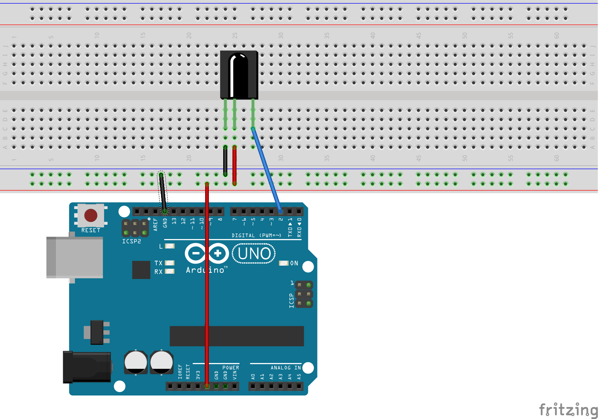
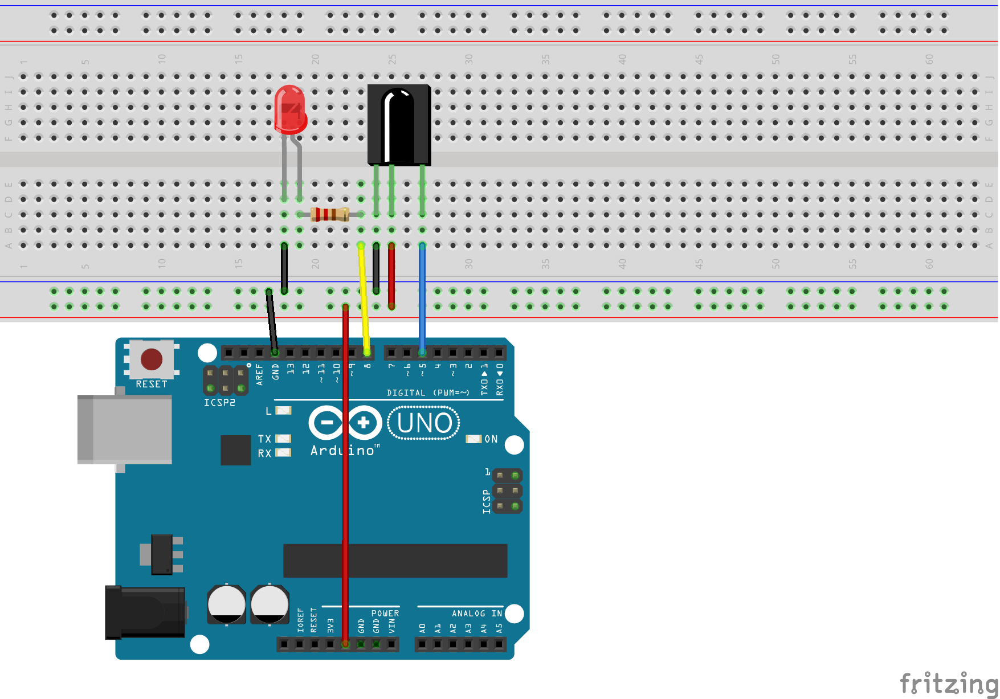

# IoT Infrarood

Deze infroarood opdracht hoort bij het vak Things tijdens het semester Internet of Things bij de Hogeschool Arnhem Nijmegen. Hierbij de uitwerkingen.

## Opdracht 1: Algemene vragen

In de volgende antwoorden zijn alle berekeningen weggelaten sinds alleen standaard natuurkundinge formulus zijn gebruikt.  

### 1. Hoe kan het dat jij infrarood licht niet kunt zien, terwijl de tv dat wel kan?
Licht en infrarood zijn beide [elektromagnetische straling](https://nl.wikipedia.org/wiki/Elektromagnetische_straling). Elektromagnetische straling kan (net als elk ander deeltje) zowel beschreven worden als golf of als deeltje volgens het [Wave–particle duality](https://en.wikipedia.org/wiki/Wave–particle_duality) concept. 

Het verschil tussen zichtbaar licht en infrarood licht is dat beide elektromagnetische stralingen een andere frequentie hebben op het [elektromagnetisch spectrum](https://nl.wikipedia.org/wiki/Elektromagnetisch_spectrum). Zichtbaar licht zit tussen de 394 en 789 THz en infrarood tussen de 0.3 en 394 THz.

Om elektromagnetische stralingen te deteteren heb je een materiaal nodig dat fotonen detecteert en omzet naar electrische signialen.  De [sensor die ik gebruik](http://docs-europe.electrocomponents.com/webdocs/1196/0900766b81196de9.pdf) voor infrarood detectie is een [photodetector](https://en.wikipedia.org/wiki/Photodetector) die het materiaal [mercury cadmium telluride](https://en.wikipedia.org/wiki/Mercury_cadmium_telluride#Infrared_detection) gebruikt voor deze detectie. Deze sensor werkt op frequenties van elektromagnetische straling rond de 315 THz (zie Fig. 11 in datasheet sensor). 

Het menselijk oog bevat heel andere materialen. In het [netvlies van je oog zitten](https://nl.wikipedia.org/wiki/Netvlies) namelijk [lichtgevoelige cellen](https://en.wikipedia.org/wiki/Photoreceptor_cell) die op een voor mij onbegrijpelijke manier electrische signalen afgeven bij bepaalde frequenties. De vier verschillende 'detectie cellen' in je oog kunnen [samen](https://upload.wikimedia.org/wikipedia/commons/9/94/1416_Color_Sensitivity.jpg) licht zien tussen de [484 en 668 THz](https://www.ncbi.nlm.nih.gov/pmc/articles/PMC1279132/). 

De reden dat wij mensen geen infrarood signiaal kunnen zien terwijl tv's dat wel kunnen is omdat het oog van een mens een ander spectrum van het electromagnetische straling opvangt dan de sensor van een tv. 

### 2. Zijn er dieren die infraroodlicht kunnen zien? Worden zij verblind als ze door je woonkamer lopen terwijl je de tv bedient?
Slangen kunnen electromagnetische straling met een golflengte tussen de [5 en 30 μm detecteren](https://www.ncbi.nlm.nih.gov/pmc/articles/PMC2693128/). Hiervoor gebruiken ze niet hun ogen, maar aparte sensortjes op de snuit. Hierdoor kunnen ze niet infrarood zien zoals wij dat zien, maar wel detecteren waar warme objecten zijn. Slangen kunnen met hun detectie in het frequentiegebied tussen de 10 en 59 THz geen afstandsbediening zien.

Van bepaalde vogels werd gedacht dat ze door infraroodzicht in het donker kunnen zien. In [dit onderzoek](http://jgp.rupress.org/content/jgp/23/6/709.full.pdf) wordt bewezen dat dit niet het geval is.

Sommigge vissen kunnen [wel elektromagnetische straling detecteren](https://link.springer.com/article/10.1007%2Fs00114-012-0980-7). Het gaat hierbij om het 'near-infrared spectrum' met golflengtus tussen de 780 en 920nm. [Een ander onderzoek](http://www.cell.com/current-biology/fulltext/S0960-9822(15)01246-4) beschrijft dat sommigge vissoorten elektromagnetische straling met golflengtes van 590 en 770nm. Komt er op neer dat er vissen zijn die frequenties tussen de 326 en 508 THz kunnen zien. Ook deze vissen zullen dus de tv afstandsbediening niet zien.

Onderstaande plaatje laat zien hoe alle bovengenoemde frequenties zich tot elkaar verhouden.


Conclusie is dat dieren geen infraroodlicht kunnen zien en dus ook niet verblind worden met een afstandsbediening. Deze conclusie kan worden gecontroleerd door op youtube te zoeken naar "animal infrared remote control". Als het mogelijk zou zijn om dieren bang te maken met je afstandbediening dan zouden er duizenden filmpjes hiervan te vinden zijn. Dit is niet het geval, dus deze conclusie is correct.

### 3. Welke “huis, tuin en keuken”-manieren zijn er te kunnen zien of je infraroodled wel echt licht geeft?
Met een digitale camera. De digitale camera ziet die frequentie in tegenstelling tot mensen wel. 


### 4. Er is in huis meer dan alleen je afstandsbediening die IR-licht uitstraalt. Wat nog meer bijvoorbeeld? En hoe kan het dat je tv daar niet af en toe per ongeluk op reageert?
Elektromagnetische straling [wordt uitgestraald](http://www.qrg.northwestern.edu/projects/vss/docs/thermal/3-what-makes-em-radiation.html) wanneer electronen binnen een atoom terugvalt in de orginele positie nadat het atoom energy heeft geabsorbeerd. Bij warme materie is dit process continu aan de gang waardoor deze straling uitzenden. Aleen materie van 0 kelvin straalt geen straling uit. Deze straling wordt ook wel [black-body radiation](https://en.wikipedia.org/wiki/Black-body_radiation) genoemd. Volgens [de wet van Planck](https://en.wikipedia.org/wiki/Planck%27s_law) is de frequentie waarin een materie black-body radiation uitzend afhankelijk van de temepratuur van de materie. 

Gebruik makend van een [online black body emission calculator](http://www.calctool.org/CALC/phys/p_thermo/wien) zijn de volgende waardes berekend:
```
20 graden celsius = golflengte 9884.93nm = frequentie 0.30THz
40 graden celsius = golflengte 9251.61nm = frequentie 0.32THz
```
Het komt er dus op neer dat alle objecten van huiskamertemepratuur infrarood uitstralen! Maar deze frequenties zijn veel te laag om opgepikt te worden door de televisie. 

In theorie zou een materie van 2776.85 graden celsius een golflengte van 950nm produceren. Als die bron ook nog het bij toeval het protocol van de tv-afstandsbediening weet uit te zenden dan zou in theorie de tv aangezet kunnen worden. Maar dit is praktisch ongelofelijk onmogelijk.

### 5. Hoe kan je tv onderscheid maken tussen verschillende knoppen?
Elke knop op je afstandsbediening zend een andere code uit. Dus het pattroon waarin het infrarood ledje knippert is blij elke knop uniek. De tv herkent dit pattroon en weet zo welke knop is ingedrukt. 

### 6. Hoe kan het dat je tv (over het algemeen) niet reageert op de afstandsbediening van je dvd-speler of die van de tv van je buurvrouw?
Het pattroon dat de tv en afstandsbediening afspreken bevat ook een gedeelte dat voor elke tv anders is. Dit is de aparaatcode. Door deze code elke keer mee te sturen wanneer de afstandsbediening een signiaal verzend kunnen alle ontvangende apparaten contorleren of deze code overeenkomt met de eigen code. Als dit het geval dan weet het ontvangende aparaat dat het signiaal van zijn afstandsbediening komt. 

### 7. Hoe kan het dat sommige knoppen als ze ingedrukt worden steeds effect blijven houden (zoals de volumeknoppen) en andere niet (bijvoorbeeld de “2”-knop)?
De afstandsbediening is dom in de zin dat hij bij een ingedrukte knop continu het afgesproken pattroon blijft knipperen. Dit geld voor alle knoppen. De ontvangende partij kan doen met deze informatie wat hij wil. Zo zal een tv die een aan/uit knop pattroon ontvangt zichzelf uitzetten en pas weer een aan/uit knop pattroon accepteren wanneer het een tijdje stil is. Bij de vollumeknop zal er een andere logica in de tv zitten die er voor zorgt dat zolang het pattroon binnen komt elke halve seconde het volume wordt verhoogd. 

## Opdracht 2: Opdracht 2Aansluiten en testen
*Sluit de IR-sensor aan en voeg een ledje (met voor jou zichtbaar licht) toe. Schrijf een testprogramma dat het ledje aan laat gaan zodra er een IR-signaal binnenkomt, en weer uit zodra er (na een korte wachttijd) weer een IR-signaal binnenkomt. Als je klaar bent, kun je het ledje met een willekeurige druk op de afstandsbediening toggelen.*

Schema:


Werking:


### Geeft de sensor “HIGH” bij het ontvangen van een signaal of juist bij afwezigheid ervan?
De sensor geeft een LOW signiaal wanneer er geen infraroodsigniaal wordt ontvangen.

### Wat is de minimale wachttijd die je nodig hebt om te voorkomen dat het ledje gaat knipperen? Wat betekent dat?
Een delay van 99 ms zorgt ervoor dat hij 'het doet' met mijn eigen afstandsbediening en die van school. Dit betekent dat als een knop is ingedrukt bij beide afstandsbedieningen er binnen 99 ms een infrarood signiaal wordt ontvangen. 

## Opdracht 3: Code opvangen met digitalRead
*Schrijf een (nieuw) programma dat in de loop steeds een digitalRead op de IR-poort uitvoert. Laat het programma de lengte van een puls meten en de lengte naar de serial schrijven zodra de puls afgelopen is. Doe dan hetzelfde voor de afwezigheid van de puls, en blijf dit herhalen. Je krijgt dan dus een patroon te zien van hoe lang de HIGH heeft geduurd, hoe lang de LOW heeft geduurd, etc. Doe je metingen in microseconden, want de pulsjes duren heel kort.*

*Test je programma door een aantal keer dezelfde knop op de afstandsbediening te gebruiken en bekijk of het in de Serial geprinte resultaat steeds (ongeveer) hetzelfde is.*

Het resultaat van drie keer een druk op de aan/uit knop op de afstandsbediening:

| test 1      | test 2      | test 3         |
| ----------- | ----------- | -------------- |
| on 26039812 | on 8349040  | on for 8545292 |
| of 8824     | of 8832     | of for 8868 |
| on 4072     | on 4096     | on for 4032 |
| of 288      | of 292      | of for 324 |
| on 12       | on 8        | on for 12 |
| of 12       | of 8        | of for 8 |
| on 20       | on 884      | on for 12 |
| of 12       | of 8        | of for 12 |
| on 6364     | on 9500     | |
| of 12       | of 8        | |

Elke keer is het pattroon soort van gelijk, maar er zitten best grote verschillen tussen. Te grote verschillen om een knop te kunnen herkennen.

Schema:


Werking:



## Opdracht 4: Onderzoek hoe lang een print naar Serial duurt
*Schrijf een (nieuw) programma waarmee je, onafhankelijk van de IR-opdracht, meet hoe lang het eigenlijk gemiddeld duurt om een print naar Serial te doen. Let op: het “opstarten” van de Serial (Serial.begin()) kost wat tijd. Geef je programma die tijd (met een delay van bijvoorbeeld 250ms in de setup) en start daarna pas je metingen.*
*Herhaal (ook bij de volgende opgaven) alle metingen een aantal keer: noteer de gemiddelden en de standaarddeviatie, en doe je metingen niet in milliseconden, maar in microseconden. Houd er ook rekening mee dat een actie soms zo kort duurt dat het weinig nut heeft om een enkele uitvoer te meten: herhaal de actie dan bijvoorbeeld 1000 keer, en deel het resultaat door 1000. Doe dit meerdere keren om de standaarddeviatie te kunnen bepalen.*

Ik verwacht dat de langere tekstlengte, lage baudrate en de toevoeging van een newline allemaal de snelheid verlagen. Verder verwacht ik dat de sneleheid van printen rond de 1 a 2 milliseconde zal zitten.

Test 1 test alle combinaties van verschillende baudrate's, teskstlengtes en printmethods. Hierbij wordt voor de korte tekst de letter `a` gebruikt en voor de lange tekst de volgende letterreeks: `aHR0cHM6Ly93d3cueW91dHViZS5jb20vd2F0Y2g/dj1kUXc0dzlXZ1hjUQ==`. Na elke testronde wordt de serial geflusht zodat alle data verzonden is. Verder wordt bij elke `Serial.begin()` de uitvoertijd van deze methode gemeten. De resultaten zijn:

| method | textsize | baudrate | average over 100 calls in micros |
| ------ | -------- | -------- | ---------------------- |
| println | short | 2400   | 12495 |
| println | short | 9600   | 3120 |
| println | short | 57600  | 510 |
| println | short | 115200 | 255 |
| println | long  | 2400   | 258230 |
| println | long  | 9600   | 64480 |
| println | long  | 57600  | 10540 |
| println | long  | 115200 | 5270 |
| print   | short | 2400   | 4165 |
| print   | short | 9600   | 1040 |
| print   | short | 57600  | 170 |
| print   | short | 115200 | 85 |
| print   | long  | 2400   | 249900 |
| print   | long  | 9600   | 62400 |
| print   | long  | 57600  | 10200 |
| print   | long  | 115200 | 5100 |
`Average time Serail.begin() over 16 runs is 945 micros`

### Maakt het uit hoeveel tekst je naar Serial stuurt?
Gemiddeld duren alle tests met lange teksten 83.265 milliseconden en gemiddeld alle korte teksten 2.730 milliseconden. Conclusie is dus dat de hoeveelheid tekst wel degelijk invloed heeft op de snelheid van berichten.

Wat interesant is is dat de lange tekst van 60 karakters per karakter 1.38775 ms duurde, terwijl de korte tekst met 1 karakter 2.730 milliseconde duurde. Het is dus efficienter om langere berichten te sturen in plaats van meerdere korte berichten.

### Kost het schrijven van een newline extra tijd?
Gemiddeld duren alle tests met de print methode 4.1632 ms en gemiddeld alle println methodes 4.43625 ms. De toevoeging van println zorgt dus voor een iets langere berichttijd. 

### Maakt de baudrate uit?

De gemiddelde baud rates per berichten zijn als volgt:

| baud rate | average message time in ms |
| ---- | -------- |
| 2400 | 131.1975 |
| 9600 | 32.760 |	
| 57600 | 5.355 |	
| 115200  | 2.6775 |

Een hogere baud rate zorgt dus voor een sneller berichtoverdracht.

### Maakt het uit of je Serial venster open staat (hint: om de metingen te kunnen inzien kun je het EEPROM-geheugen en een extra programma gebruiken)?
Deze test wordt uitgevoerd in test2.cpp. Zie `opdracht-4/test2/readme.txt` om meer over de werking van de test te lezen. De test gebruikt println, 60 karakter berichten en baudrate 9600. De connected test kostte dit 64.480 ms per bericht. De nieuwe niet-verbonden test kostte 64.480 ms per bericht. Dit is ongelofelijk precies gelijk, maar ook na herhaling van de test blijft dit getal gelijk. Er is dus geen verschil of de serial monitor aan of uit staat.

### Hierboven staat dat het opstarten van de Serial tijd kost. Is dat eigenlijk wel waar, en hoeveel tijd is dat dan?
Ja, het opstarten van Serial kost tijd, maar niet zo veel tijd. Om precies te zijn 0.945 ms zoals te zien is in de resultaten van test1.

### Conclusie
Met de standaard baudrate van 9600 is de snelheid van een 1-karakter bericht 2.080 ms. Bij de langere berichten van 60 karakters is dit 63.44 ms. Ik had verwacht dat alle berichten gemiddeld rond de 2 ms zouden zitten. Dit blijkt dus wel een stuk hoger te zijn. Ik neem hiervan mee dat ik voortaan beter een hogere baudrate kan gebruiken.

## Technische Beoordeling Opstellingen: Opzet
In de komende opdrachten (5, 7, 8 en 9) worden vier verschillende opstellingen gebouwd om de periode aan/uit van een infraroodsigniaal te ontvangen. Om deze verschillende opstellingen te kunnen vergelijken heb ik een experiment ontworpen waarmee de opstellingen met elkaar kunnen worden vergeleken. In dit hoofdstuk wordt dit experiment uiteengezet.

In een idealse situatie zouden de meetwaarden aan de infraroodsensor bij twee keer indrukken van de zelfde knop exact gelijk zijn. Er zijn helaas te veel factoren die invloed hebben op de meetdata dat het praktisch onmogelijk is dit te bereiken. Door per opstelling vijf keer de zelfde knop op de afstandsbediening in te drukken, en te noteren wat de uitvoer is kan worden gerekend aan de verschillende opstellingen. Met deze meetwaarden worden een aantal feiten berekend die gebruikt kunnen worden om de opstellingen te vergelijken. Alle berekeningen worden gedaan in [meetanalyse.xlsx](meetanalyse.xlsx).

Bij deze beoordeling wordt de correctheid van de meting niet meegenomen. Als er constant een incorrect signiaal wordt gemeten, maar dit signiaal is wel uniek genoeg om de knop te kunnen herkennen dan is dit voldoende. Een inconsistente opstelling waarbij soms een correct signiaal wordt gemeten, maar soms ook een heel ander signiaal wordt gemeten bij de zelfde afstandsbediening knop is minder wenselijk. Vandaar dat bij de beoordeling van opstellingen naar consistentie wordt gekeken.

### Afwijking in resultaten 
De afwijking in resultaten tussen verschillende tests van belang. Als de eerste 'uit' periode van een infraroodsigniaal de ene keer 500 microseconden en duurt de volgende keer 800 microseconden, dan is de opstelling minder nauwkeurig dan dat er de tweede keer 505 microseconden wordt gemeten.

Om tot een beoordeling te komen moet per periode die door de arduino wordt geregistreerd als 'ir aan' of 'ir uit' een standaardafwijking berekend worden. Door het gemiddelde te berekenen van deze standaardafwijkingen wordt de gemiddelde afwijking in resultaten gevonden. Dit getal kan worden gebruikt om de verschillende opstellingen te vergelijken.

### Consistentie afwijking
Ten tweede moet worden gekeken in hoeverre de opstelling constant is. Als het programma elke 3e meting ineens extra tijd nodig heeft dan worden er inconsistente metingen gedaan. Als de eerste 'uit' periode van een infraroodsigniaal steeds erg consistent wordt gemeten, maar het volgende 'aan' signiaal wordt relatief vaak inconsistent gemeten dan is een teken van inconsistentie. 

Om tot een beoordeling te komen moet per periode die door de arduino wordt geregistreerd als 'ir aan' of 'ir uit' een standaardafwijking berekend worden. Op deze set van standaardafwijkingen moet opnieuw een standaardafwijking worden gedaan om tot de consistentie van de afwijkingen te komen. Dit getal kan worden gebruikt om de verschillende opstellingen te vergelijken.

### Opstelling
Om te zorgen dat alle codes eerlijk worden gemeten wordt de volgende opstelling gebruikt waarbij de afstand tussen verzender en ontvanger altijd constant is. De opstelling is als volgt:



## Opdracht 5: Introduceer buffer met malloc en realloc
*Het zou kunnen dat je metingen beïnvloed worden door het steeds printen naar de Serial (het printen kost immers tijd). Om dit uit te sluiten, gaan we pas printen zodra er een bepaalde tijd (zie Opdracht 2:) geen wijziging meer is ontvangen in de puls: de code is dan afgelopen. Uiteraard moeten de metingen wel opgeslagen worden. Doe dit in een dynamisch (niet-circulair) buffer waarbij je steeds als er een waarde wordt toegevoegd, de grootte van de buffer aanpast. Zodra de code is afgelopen en de waarden zijn geprint, verklein je de buffer weer naar 0 bytes. Schrijf een nieuw programma dat dit doet. Je mag de aan-/uit-tijden gewoon achter elkaar in 1 int-buffer zetten. Je krijgt dan dus weer een patroon van HIGH- en LOW-waarden na elkaar, maar kunt in de buffer niet zien welke LOW en HIGH worden (omdat een signaal altijd met een HIGH of LOW begint, kun je dat als het goed is echter wel afleiden als je wil).*

[Het testprogramma](opdracht-5/main.cpp) bevat het programma zoals hierboven beschreven. De testopstelling is als volgt:


Het resultaat weergegeven in een grafiekje is hieronder te zien. 



In deze grafiek staat op de y ass de periode in microseconden en op de x ass het aantal perioden. De oranje en blauwe lijn representeren de output van twee verschillende knoppen.

Dit is een succesvol resultaat omdat te zien is dat twee verschillende knoppen de zelfde beginstructuur hebben. Dit is in lijn met de verwachtingen dat alle signialen van de afstandbediening allemaal beginnen met een aparaatcode die voor elke knop gelijk is.

### Technische Beoordeling Opstelling: Resultaat
| | |
| ---- | --- |
| Code | [opdracht-5/main.cpp](opdracht-5/main.cpp) |
| Meetgegevens | [opdracht-5/testdata.csv](opdracht-5/testdata.csv) |
| Afwijking in resultaten | 9.96 |
| Consistentie afwijking | 12.23 |

### Wat gebeurt er als je heel snel achter elkaar op een knop van de afstandsbediening blijft drukken?
Een korter siginiaal herhaalt zich. Hieronder een grafiek van dit signiaal nadat de het initiele siginaal zoals hierboven is afgelopen



## Opdracht 6: onderzoek hoe lang malloc, realloc en free duren
*Schrijf een nieuw programma om te meten hoe lang een malloc, realloc en free duren. Beantwoord daarbij in elk geval de volgende vragen en noteer de waarden (uiteraard moet je alle metingen een aantal keer herhalen: noteer de gemiddelden en de spreiding):*

[Testprogramma 5](opdracht-5/main.cpp) bevat een aantal tests. De resultaten van deze tests zijn hieronder weergegeven.
```
A: Gemiddelde tijd dat het kost om 50 bytes te alloceren over een gemiddelde van 1000 tests is 3 microseconden.
B: Gemiddelde tijd dat het kost om 150 bytes te alloceren over een gemiddelde van 1000 tests is 3 microseconden.
C: Gemiddelde tijd dat het kost om 1 byte te reloccen naar 150 bytes terwijl er verder niks speciaals is gealloceerd over een gemiddelde van 1000 tests is 14 microseconden.
D: Gemiddelde tijd dat het kost om 1 byte te reloccen naar 150 bytes terwijl er verder al 150 bytes gealloceerd zijn over een gemiddelde van 1000 tests is 14 microseconden.
E: Gemiddelde tijd dat het kost om 1 byte te reloccen naar 50 bytes terwijl er verder niks speciaals is gealloceerd over een gemiddelde van 1000 tests is 14 microseconden.
F: Gemiddelde tijd dat het kost om 150 bytes te reloccen naar 1 byte terwijl er verder niks speciaals is gealloceerd over een gemiddelde van 1000 tests is 16 microseconden.
G: Gemiddelde tijd dat het kost om 50 bytes te calloc-en over een gemiddelde van 1000 tests is 3 microseconden.
H: Gemiddelde tijd dat het kost om 50 bytes te alloceren en daarna handmatige te initaliseren  over een gemiddelde van 1000 tests is 34 microseconden.
I: Gemiddelde tijd dat het kost om 50 bytes te free-en over een gemiddelde van 1000 tests is 3 microseconden.
I: Gemiddelde tijd dat het kost om 5 bytes te free-en over een gemiddelde van 1000 tests is 3 microseconden.
```
Alle onderstaande vragen worden beantwoord met data uit bovenstaande testresultaten.

*A: Hoe lang duurt een malloc?*

3 microseconden


*B: Maakt het uit hoeveel geheugen je alloceert?*

Nee. Voor 50 en 150 bytes is de tijd het zelfde.

*C: Hoe lang duurt een realloc?*

14 microseconden


*D: Maakt het uit hoeveel geheugen er al gereserveerd was?*

Nee. Bij de tests waarbij er extra geheugen van te voren gealloceerd was is geen verschil in tijd te zien.


*E: Maakt het uit hoeveel geheugen je extra alloceert?*

Nee. Van 1 naar 150 en van 1 naar 50 kost beide 14 microseconden.


*F: En is er verschil tussen het vergroten of juist verkleinen van de gealloceerde geheugenruimte?*

Ja. Realloc van 150 naar 1 byte kost gemiddeld 16 microseconden terwijl realloc van 1 byte naar 150 bytes iets sneller is met 14 microseconden.


*G: In de slides werd gezegd dat calloc langer duurt dan malloc. Is dat eigenlijk wel waar?*

Nee. Beide zijn even snel.


*H: Is “handmatig” initialiseren van de waarden na een malloc sneller of langzamer dan een calloc?*

Langzamer. Calloc kost 3 microseconden voor het alloceren en initialiseren van 50 bytes en malloc+handmatige initalizatie kost 34 microseconden.


*I: Maakt het voor een free uit hoeveel geheugen er gealloceerd was?*

Nee. Het vrijgeven van 5 bytes tegenover 50 byte gaat even snel.


## Opdracht 7: Gebruik een circulair buffer
*Ook realloc en malloc kunnen de metingen beïnvloed hebben (die kosten immers tijd). Om dat uit te sluiten, gaan we gebruik maken van een circulair buffer dat realtime niet aangepast hoeft te worden. Doe hetzelfde als bij Opdracht 5:, maar maak gebruik van een circulair buffer waarvan de grootte compile-time bepaald is. Schrijf hiervoor een nieuw programma. Hoe groot moet je buffer minimaal zijn om geen gegevens kwijt te raken? Sla wederom zowel LOW- als HIGH-waarden op, achter elkaar, in microseconden.*

De uitwerkingen zijn [hier](opdracht-7) te vinden. De testopstelling is als volgt:
                                                   


De resultaat output zijn qua structuur gelijk aan die van opdracht 5, al zijn de specefieke getallen net iets anders. Op dit moment heb ik nog niet genoeg informatie om te kunnen zeggen of deze implementatie ook daadwerkelijk accurater is dan die van opdracht 5. 

De grote van de buffer moet minimaal 67 metingen kunnen bevatten omdat de afstandsbediening maximaal dit aantal verschillende lengte pulsen verstuurd.

### Technische Beoordeling Opstelling: Resultaat
| | |
| ---- | --- |
| Code | [opdracht-7/main.cpp](opdracht-5/main.cpp) |
| Meetgegevens | [opdracht-7/testdata.csv](opdracht-5/testdata.csv) |
| Afwijking in resultaten | 5.71 |
| Consistentie afwijking | 2.70 |

## Opdracht 8: Maak gebruik van interrupts
*Misschien beïnvloedt digitalRead de metingen ook wel. Schrijf een nieuw programma gebaseerd op opgave 7, waarbij je geen digitalRead meer gebruikt, maar interrupts (op zowel wijziging naar “hoog” als naar “laag”).*  
*Let op: omdat Serial ook gebruik maakt van interrupts, kun je problemen krijgen (deadlocks) als je de Serial gebruikt in je eigen interruptfunctie. Laat het testen of er voldoende tijd verstreken is en het printen van de buffer dus buiten de interruptfunctie gebeuren.*

De uitwerking van deze opdracht is [hier](opdracht-8/main.cpp) te vinden. Het bijbehorende aansluitschema is als volgt:



De grote van de buffer moet minimaal 67 metingen kunnen bevatten omdat de afstandsbediening maximaal dit aantal verschillende lengte pulsen verstuurd.

### Technische Beoordeling Opstelling: Resultaat
| | |
| ---- | --- |
| Code | [opdracht-8/main.cpp](opdracht-5/main.cpp) |
| Meetgegevens | [opdracht-8/testdata.csv](opdracht-5/testdata.csv) |
| Afwijking in resultaten | 22.86 |
| Consistentie afwijking |  8.28 |

## Opdracht 9: Lees de ruwe pin-data
*Een andere manier om om digitalRead heen te werken, is het uitlezen van de ruwe pin-data. DigitalRead doet dat ook, maar bevat wat overhead die je nu niet kunt gebruiken.*
* Schrijf een nieuw programma, gebaseerd op je code bij Opdracht 7:, waarbij je direct pinaansturing gebruikt.*

De uitwerking van deze opdracht is [hier](opdracht-9/main.cpp) te vinden. Bijbehorden opstelling is als volgt:


De grote van de buffer moet minimaal 67 metingen kunnen bevatten omdat de afstandsbediening maximaal dit aantal verschillende lengte pulsen verstuurd.

### Technische Beoordeling Opstelling: Resultaat
| | |
| ---- | --- |
| Code | [opdracht-9/main.cpp](opdracht-5/main.cpp) |
| Meetgegevens | [opdracht-9/testdata.csv](opdracht-5/testdata.csv) |
| Afwijking in resultaten | 7.99 |
| Consistentie afwijking | 10.27 |

## Technische Beoordeling Opstellingen: Conclusie
De gegevens zoals verzameld in de vorige hoofdstuken zijn als volgt samengevat:

|                           | Opdracht 5         | Opdracht 7        | Opdracht 8 | Opdracht 9 |
| ---                       | ---                | ---               | ---        | --- |
| Titel                     | Malloc en realloc  | Circulaire buffer | Interrupts | Directe aansturing |
| Afwijking in resultaten   |  9.96              | 5.71              | 22.86      | 7.99  |
| Consistentie afwijking    | 12.23              | 2.70              | 8.28       | 10.27  |

Het eerste dat opvalt is dat de variant met interrupts de meeste afwijking in resultaten heeft is. Deze geeft dus de minst constante metingen.

Verder is de afwijking in resultaten tussen opdracht 5, 7 en 9 redelijk gelijk. Daar durf ik geen verdere conclusies uit te trekken sinds de dataset ook een beetje klein is.

De consistentie in afwijking is wel opvallend. De implementatie van opdracht 7 met een circulaire buffer en gebruik van `digitalRead` is het meest consistent. In vergelijking met opdracht 5 waarbij met malloc en realloc steeds memory moet worden gealloceerd is dit te verklaren sinds malloc en realloc veel impact hebben op de werking van het programma (zie opdracht 6). Maar in vergelijking met opdracht 9 is dat raar. In opdracht 9 wordt een directe aansturing van de pins wordt gebruikt in plaats vna de `digitalRead` in opdracht 7. Dit zou een positieve tot geen impact moeten hebben op de consistentie. Maar volgens de metingen is de afwijking van de metingen in opdracht 9 bijna 4 keer zo inconsistent. 

Het is dus nodig om de meetresultaten te valideren. Als controle is de test met code van opdracht 9 nogmaals 20 keer uitgevoerd. De resultaten zijn weer te vinden in [meetanalyse.xlsx](meetanalyse.xlsx). Het resultaat van deze test is een gemiddelde standaardafwijking van 39.60 en 52.79 en een consistentie in de afwijking van 4.66 en 3.71. Het komt er op neer dat er nu hele andere testresultaten uitkomen. Dit laat zien dat alle consistentie metingen in dit onderzoek onbetrouwbaar zijn en dat de 7 uur die ik hieraan heb besteed niet nuttig waren. Jammer.

De conclusie is dat het meten van consistentie van een softwareprogramma met behulp van hardware aansturing onbetrouwbaar is sinds (blijkbaar) de hardware opzichzelf inconsistent is.

## Opdracht 10: Vertraagde afstandsbediening
*Sluit een infrarood-led en een knop aan op je Arduino en breid je programma zo uit (maak eerst een kopie) dat het in de buffer opgeslagen signaal op de IR-led wordt afgespeeld op het moment dat je op de knop drukt. Alternatief is dat je het opgeslagen signaal met een factor 10 of 100 vertraagd laat afspelen op een zichtbare led. Dat is minder leuk, maar geeft wel een mooie lichtshow ;-)*

Sinds ik geen aparaat heb dat reageert op een ir signiaal heb ik deze opdracht geimplementeerd met een normale led. De led knippert 10.000 keer langzamer dan het ontvangen signiaal. De opstelling hierbij is als volgt:



Het programma werkt! en ziet er zo uit:


## Opdracht 11: Lampen schakelen met je afstandsbediening
*Sluit (minimaal) drie ledlampjes aan op je Arduino en zorg ervoor dat je die kunt aan- en uitzetten met de knoppen 1, 2 en 3 op je afstandsbediening. Daarnaast moet er een knop zijn waarmee je ineens alle ledjes kunt aan- en uitzetten.*

